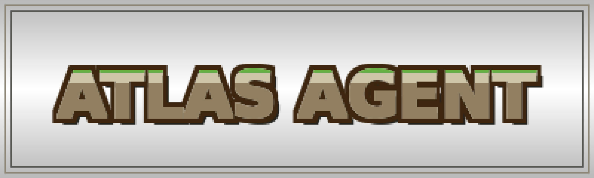

--------------------------------------------------------------------------------

English | [简体中文](./README.zh-CN.md)

Welcome to the Atlas Agent GitHub.

**The personal knowledge agent built for notes, PDFs, and captured web knowledge.** Atlas Agent is a CLI-first system for turning fragmented material into a searchable, citeable, and reusable working knowledge base. It is being built as an engineering project rather than a thin chat wrapper, with a real agent loop, structured tools, persistent state, and observable execution.

Use a hosted API or any OpenAI-compatible endpoint. The project is being designed so the knowledge workflow, not vendor lock-in, stays at the center. The goal is to make retrieval, note operations, session memory, and runtime tracing work as one coherent agent system.

<table>
<tr><td><b>A real agent loop</b></td><td>Tool-driven orchestration for search, note operations, summarization, and grounded answers instead of a single-pass chat shell.</td></tr>
<tr><td><b>Retrieval with citations</b></td><td>Import Markdown, PDF, and captured web content, then answer questions with explicit references to supporting material.</td></tr>
<tr><td><b>Session memory</b></td><td>Persistent conversations, history lookup, and context compression to support multi-turn knowledge work without losing continuity.</td></tr>
<tr><td><b>Note operations</b></td><td>Create, update, and organize notes through structured tools so the agent can act on the knowledge base, not just read from it.</td></tr>
<tr><td><b>Traceable execution</b></td><td>Model calls, tool usage, latency, retries, and failures are meant to be inspectable so behavior can be debugged and evaluated.</td></tr>
<tr><td><b>Safety guardrails</b></td><td>Parameter validation, timeout control, and baseline prompt-injection resistance are part of the core design rather than afterthoughts.</td></tr>
</table>

---

## Current Stage

Atlas Agent is currently in the **planning and repository bootstrap** stage.

The repository now contains:

- bilingual project-facing README files
- the initial public repository structure
- the preserved project license
- a concrete architecture and implementation direction maintained locally for development

The core runtime, retrieval pipeline, session store, and tool implementations have **not** been built yet. The next phase is to produce the first runnable workflow around ingestion, retrieval, note actions, and session persistence.

---

## What This Project Is

Atlas Agent is a knowledge agent for:

- personal research
- note organization
- document-grounded question answering
- long-running knowledge workflows

It is meant to support real knowledge work rather than isolated prompts. The system is being shaped so it can retrieve evidence, manage notes, preserve context across sessions, and expose its own behavior in a way that is easy to inspect and improve.

## Architecture Direction

The project is being shaped around a small number of stable subsystems:

- a CLI entry layer for local workflows
- an agent runtime responsible for orchestration and tool-use loops
- a tool registry that exposes structured capabilities to the model
- a retrieval and ingestion layer for knowledge processing
- a persistence layer for sessions, memory, notes, and trace data
- an observability and safety layer for evaluation and runtime control

This direction keeps the system grounded in explicit interfaces, making later debugging, evaluation, and extension more manageable.

## Main Work Areas

The repository is intended to grow around these work areas:

- agent loop design and tool dispatch
- RAG ingestion, chunking, indexing, and retrieval
- session memory, history lookup, and context compression
- note lifecycle management
- tracing and evaluation workflows
- safety guardrails and failure handling

## Why This Project

Many knowledge-focused AI demos stop at simple retrieval. Atlas Agent is intended to go further by treating knowledge work as an end-to-end agent problem: ingesting information, retrieving evidence, acting on notes, preserving useful context across sessions, and exposing the system's own behavior in a way that can be inspected and improved.

The long-term goal is to build a serious personal knowledge agent with clear engineering boundaries and room for future growth.
